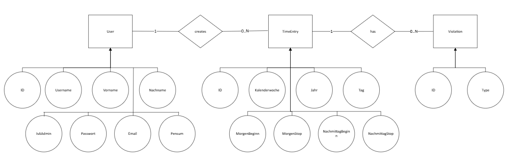

# Arbeitszeit-Auswertungs Programm

> 🚧 Replace the screenshot with one that shows your main screen.


---

This project is intended to:

- Practice the complete process from **application requirements analysis to implementation**
- Apply advanced **Python** concepts in a browser-based application (NiceGUI)
- Demonstrate **data validation**, a clean architecture (presentation / application logic / persistence), and **database access via ORM**
- Produce clean, well-structured, and documented code (incl. tests)
- Prepare students for **teamwork and professional documentation**
- Use this repository as a starting point by importing it into your own GitHub account  
- Work only within your own copy — do not push to the original template  
- Commit regularly to track your progress

---
## 📝 Application Requirements

---

### Problem

Das Problem ist, dass der Vorgesetzte ein File erhält in dem alle Mitarbeiter ihre gestempelten Zeiten eintragen und er muss immer alles manuell berechnen. Er muss berechnen wie lange die Mitarbeiter gearbeitet haben und schauen, ob sie die vertraglichen Rahmenbedingungen verletzt haben. Er möchte eine Übersicht haben über die jeweiligen Mitarbeiter, in der gezeigt wird: Mitarbeiter, Pensum, Ist-Zeit, Soll-Zeit, Differenz-Stunden, Einhaltung der Rahmenbedinungen und falls verletzt, Welche Rahmenbedingung verletzt wurde und dies nicht immer manuell berechnen müssen. Mitarbeiter sollen nun ihre Stunden digital auf der App erfassen und ihre eigenen Stundenauszug sehen können.

---

### Scenario

Der User will eine Übersicht über die Stunden haben, indem ein er ein File importiert, welches die wöchentliche Stemplungen der Mitarbeiter beinhaltet. Schlussendlich soll er als Output im Browser , eine Übersicht erhalten in der aufgeführt ist:
- Nachname, Vorname, Pensum
- Effektivstunden
- Soll-Zeit
- Differenz-Zeit
- Pausen-Zeit
- Vertragsbedingungen eingehalten?
- Begründung der Vertrags-Verletzung

Der User soll ene Gesamtübersicht erhalten, aber auch die Option haben, individuelle Mitarbeterauszüge nach Kalenderwoche anzuschauen.
---

## User Stories

### 1. Worker: Login
**Als Worker möchte ich, mich einloggen und meine Module sehen basierend auf meiner Berechtigung**

**Inputs:** Login(Email,Password) 
**Outputs:** none

### 2. Worker: Stundeneintrag
**Als Worker möchte ich, mich einloggen und meine Arbeitsstunden eintragen für eine Kalenderwoche**

**Inputs:** ?list([entry])  
**Outputs:** ?list([entry])  

### 3. Worker: Stundenübersicht
**Als Worker möchte ich, mich einloggen und meine individuelle Arbeitsstundenauszüge sehen pro Kalenderjahr und möchte eine detaillierten Auschnitt sehen (Soll-Ist Zeit, Diferenz usw.)**

**Inputs:** none  
**Outputs:** list([entry]) "where UserID matches"

### 4. Worker: Stundenanpassung
**Als Worker möchte ich, mich einloggen und meine Arbeitsstunden der jetzigen Kalenderwoche modifizieren**

**Inputs:** ?list([entry])  
**Outputs:** ?list([entry])

### 5. Worker: Logout
**Als Worker möchte ich, mich ausloggen können.**

**Inputs:** logout()
**Outputs:** none

### 6. Admin: Login
**Als Admin möchte ich, mich einloggen und meine Module sehen basierend auf meiner Berechtigung**

**Inputs:** Login(Email,Password) 
**Outputs:**

### 7. Admin: Stundenübersicht
**Als Admin möchte ich, eine Übersicht der Soll-Zeit, Differenz-Zeit,Pensums jedes einzelnen Mitarbeiters erhalten, der bereits Einträge erstellt hat.**

**Inputs:** none  
**Outputs:**  list([entry]) "All UserID"

### 8. Admin: View Violations Menu
**Als Admin möchte ich, eine Angabe erhalten ob die vertraglichen Rahmenbedingungen eingehalten wurden und gegebenenfalls eine Angabe erhalten welche Rahmenbedingung verletzt wurde pro Mitarbeiter.**

**Inputs:** none  
**Outputs:** list([violations]) "All UserID"

### 9. Admin: User Managment Menu 
**Als Admin möchte ich,neue Mitarbeiter erfassen oder entfernen.**

**Inputs:** createUser(Name,Pensum,Email,Passwort)  
**Outputs:** newUser

### 10. Admin: Logout
**Als Admin möchte ich, mich ausloggen können.**

**Inputs:** logout()
**Outputs:** none
---

### Use cases


## Main Use Cases

1. Arbeitszeiten eintragen
2. Arbeitszeiten ändern
3. Eigene Arbeitszeitübersicht anzeigen
4. Arbeitszeiten der Worker überprüfen
5. Regelverletzungen anzeigen und überprüfen
6. Benutzer anlegen
7. Benutzer löschen

### Technical Use Cases

1. Login
2. Logout

**Actors**
- Worker:   ist ein normaler Benutzer der Anwendung. Er kann eigene Arbeitszeiten erfassen, ändern und seine persönliche Übersicht einsehen.
- Admin:    verwaltet die Benutzer und überprüft die erfassten Arbeitszeiten der Worker. Zusätzlich kann der Admin Regelverletzungen einsehen und kontrollieren.

---

### Wireframes / Mockups

> 🚧 Add screenshots of the wireframe mockups you chose to implement.

**Start:**


**Admin Bereich:**


**Worker Bereich:**


**Created with Balasmiq, free trial version**
---

## 🏛️ Architecture

> 🚧 Document the architecture components, relationships, and key design decisions.

### Software Architecture

> 🚧 Insert your UML class diagram(s). Split into multiple diagrams if needed.


**Layers / components:**
- UI (Presentation Layer): Wir nutzen NiceGUI für das Frontend. Der Browser dient hier als reiner "Thin Client". Er zeigt die Daten nur an und schickt Eingaben ans Backend.
- Service Schicht (Application Logic): Der `TimeTrackingService` ist der zentrale Punkt. Er nimmt die Anfragen der UI entgegen und delegiert sie an die Logik weiter.
- Domain (Kern Logik): Hier liegen die wichtigen Klassen wie `Worker` oder `Workweek`. Alles, was mit der Berechnung von Stunden oder dem Prüfen von Regeln zu tun hat, passiert hier.
- Persistence (Daten): Wir nutzen SQLModel als ORM. Damit speichern wir die Daten sauber in der SQLite Datenbank (`company.db`), ohne manuellen SQL Code schreiben zu müssen.

**Design decisions (examples):**
- Saubere Trennung: Wir haben darauf geachtet, dass die UI keine Business Logik enthält. Die UI ruft lediglich Funktionen wie `add_work_day()` auf. Die Logik für die Gültigkeit von Zeitstempeln oder Pausenregeln liegt allein in der Domain Schicht.
- Adapter in der UI: Funktionen wie `get_weekly_summary` im UI-Modul dienen nur dazu, die Daten aus der Datenbank für den Service passend umzubauen. Das hält den Rest der App sauber und testbar.
- Validierung: Wir trennen strikt zwischen zwei Arten von Prüfungen. Die UI prüft, ob das Format (zum Beispiel HH:MM) stimmt. Die fachliche Prüfung (zum Beispiel ob die Endzeit nach der Startzeit liegt) übernimmt die Business Logik.

**Design patterns used (examples):**
- Schichtenarchitektur / MVC: Jedes Element hat einen festen Platz (Anzeige, Logik oder Datenbank).
- Repository Pattern: Die Datenhaltung ist vom Rest der App entkoppelt.
- Strategy Pattern: Die Arbeitszeitregeln sind so gekapselt, dass man sie bei Bedarf leicht austauschen oder erweitern kann.
- Facade Pattern: Der Service bietet der UI eine einfache Schnittstelle für die komplexen Abläufe im Hintergrund.

---

### 🗄️ Database and ORM



**Entities**
User: Represents a person using the app
TimeEntry: One work-timesheet row
Violation: A rule violation tied to a time entry

**Relationships**
One User → many TimeEntry.
Each TimeEntry references one User
One TimeEntry → zero or many Violation.
Each Violation references one TimeEntry

---

## ✅ Project Requirements

---
Each app must meet the following criteria in order to be accepted (see also the official project guidelines PDF on Moodle):

1. Using NiceGUI for building an interactive web app
2. Data validation in the app
3. Using an ORM for database management

---

### 1. Browser-based App (NiceGUI)

Die gesamte Interaktion mit der Zeiterfassung findet über den Browser statt. Wir setzen dabei konsequent auf NiceGUI, um ein reaktives Web-Interface zu bieten.

**Kern-Funktionen der App:**
- Zentrales Login: Eine Einstiegsmaske validiert die Nutzerdaten und leitet Mitarbeitende oder Admins automatisch in ihren jeweiligen Bereich weiter.
- Mitarbeiter Portal: Hier können Arbeitszeiten tabellarisch für zwei Zeitblöcke pro Tag erfasst werden. Die Ansicht lässt sich nach Kalenderwochen und Jahren filtern.
- Persönliche Auswertung: Mitarbeitende sehen eine Übersicht mit Soll- und Ist-Stunden sowie der berechneten Differenz. Verstösse gegen Arbeitsregeln werden in einem einklappbaren Bereich (Accordion) direkt angezeigt.
- Admin Dashboard: Vorgesetzte erhalten eine globale Übersicht über alle Teammitglieder. Sie sehen sofort den Status der aktuellen Woche sowie detaillierte Listen über Regelüberschreitungen wie missachtete Pausenzeiten.

**Architektur Hinweis:**
Der Browser agiert als Thin Client. Das bedeutet, dass die gesamte Logik für die Berechnungen und die Verwaltung der Oberflächen-Zustände auf dem Server innerhalb der NiceGUI Applikation läuft.

---

### 2. Data Validation

Die Anwendung prüft Eingaben auf mehreren Ebenen, um die Datenintegrität sicherzustellen und Fehlermeldungen verständlich auszugeben.

**Validierung in der UI Schicht:**
In der Datei `src/ui/__init__.py` stellen wir sicher, dass nur korrekte Formate verarbeitet werden. Die Funktion `hhmm_to_decimal` prüft zum Beispiel, ob Zeitangaben im Format HH:MM vorliegen und ob die Werte für Stunden und Minuten innerhalb der logischen Grenzen liegen. Auch die Login Felder werden hier auf Vollständigkeit geprüft.

**Fachliche Validierung in der Domain Schicht:**
Innerhalb der `TimeEntry` Klasse in `src/domain/time_tracking.py` findet die logische Prüfung statt. Hier wird unter anderem sichergestellt, dass Endzeiten niemals vor den Startzeiten liegen. Zudem verhindern wir Buchungen in der Zukunft und prüfen, ob Nachmittagsblöcke überschneidungsfrei zum Morgenblock eingetragen wurden.

**Regelbasierte Validierung:**
Durch spezielle Strategy Klassen wie `BreakTimeRule` oder `MaxDailyWorkRule` prüfen wir im Hintergrund automatisch, ob gesetzliche oder vertragliche Rahmenbedingungen verletzt wurden. Dies umfasst die Einhaltung von Mindestpausen sowie die Einhaltung der maximal zulässigen Tages- und Wochenarbeitszeit.


---

### 3. Database Management

Für die Verwaltung der Daten nutzen wir SQLModel als modernem Object Relational Mapper (ORM). Die Definitionen befinden sich in `src/persistence/models.py`.

**Datenmodell und Relationen:**
- User Modell: Speichert alle Informationen zu den Mitarbeitenden inklusive ihrer Rollen (Admin oder Worker) und des jeweiligen Beschäftigungsgrads für die Sollzeit Berechnung.
- TimeEntry Modell: Dieser Teil bildet die täglichen Arbeitsstempel ab. Über den Fremdschlüssel `fk_user_id` ist jeder Eintrag fest mit einem Benutzer verknüpft. Die Zeiten werden zur besseren Berechenbarkeit als Float Werte gespeichert.
- Violation Modell: Hier werden spezifische Regelverstösse dokumentiert. Dieses Modell ist über den Fremdschlüssel `fk_TimeEntry_id` direkt mit dem entsprechenden Arbeitstag verknüpft, an dem der Fehler aufgetreten ist.

Durch den Einsatz von SQLModel können wir komplexe Abfragen und Verknüpfungen direkt in Python schreiben, was den Code wartbar und sicher gegen SQL Injektionen macht.

---

## ⚙️ Implementation

---

### Technology

- Python 3.x
- Environment: GitHub Codespaces
- External libraries: nicegui, sqlmodel, sqlalchemy, reportlab, python-dotenv, pytest, tzdata

---

### 📂 Repository Structure

```text
Workspace root/
├─ .github/
├─ .nicegui/
├─ company.db
├─ README.md
├─ requirements.txt
└─ Gruppe_06-Arbeitszeitrechner_2.0/
   ├─ docs/
   │  └─ architecture-diagrams/
   │     └─ ER_Diagram_.png
   ├─ src/
   │  ├─ controller/
   │  ├─ data_access/
   │  │  └─ Database.py
   │  ├─ domain/
   │  │  ├─ __init__.py
   │  │  ├─ config.py
   │  │  ├─ services.py
   │  │  ├─ time_tracking.py
   │  │  ├─ users.py
   │  │  └─ violations.py
   │  ├─ persistence/
   │  │  ├─ __init__.py
   │  │  ├─ models.py
   │  │  ├─ mappers/
   │  │  │  ├─ __init__.py
   │  │  │  ├─ employee_mapper.py
   │  │  │  └─ time_entry_mapper.py
   │  │  └─ repositories/
   │  │     ├─ __init__.py
   │  │     ├─ employee_repository.py
   │  │     └─ time_entry_repository.py
   │  ├─ ui/
   │  │  └─ __init__.py
   │  ├─ example_usage.py
   │  └─ main.py
   └─ tests/
      ├─ test_domain_rules.py
      ├─ test_time_tracking.py
      └─ test_users.py
```

---

### How to Run


### 1. Project Setup
- Python 3.13 (or the course version) is required
- Create and activate a virtual environment:
   - **macOS/Linux:**
      ```bash
      python3 -m venv .venv
      source .venv/bin/activate
      ```
   - **Windows:**
      ```bash
      python -m venv .venv
      .venv\Scripts\Activate
      ```
- Install dependencies:
   ```bash
   pip install -r requirements.txt
   ```

### 2. Configuration
Die Applikation nutzt eine lokale SQLite Datenbank (`company.db`). Es ist keine zusätzliche Konfiguration von Umgebungsvariablen oder `.env` Dateien notwendig. Die Datenbank wird beim ersten Start automatisch initialisiert.

### 3. Launch
Starte die NiceGUI App mit dem folgenden Befehl:
```bash
python -m src.main
```
Die Applikation öffnet sich daraufhin automatisch in deinem Standardbrowser unter `http://localhost:8080/`. Falls dies nicht geschieht, klicke auf den Link in der Konsole.


### 4. Usage (Step-by-Step)
Nach dem Start der Anwendung können sich Mitarbeitende und Admins mit ihren jeweiligen Zugangsdaten anmelden. Die Anwendung bietet spezifische Funktionen für zwei Nutzerrollen:

**Als Worker (Mitarbeiter):**
-   **Login Daten:** Benutzername: `berisha`, Passwort: `1234`
-   Logge dich ein und navigiere zum Bereich **Stunden erfassen**.
-   Wähle die gewünschte Kalenderwoche sowie das Jahr aus.
-   Trage deine Arbeitszeiten für den Vormittags- und Nachmittagsblock im Format `HH:MM` ein und klicke auf Speichern.
-   Kontrolliere im Tab **Meine Übersicht** deine berechneten Ist-Stunden, die Differenz zur Soll-Zeit sowie mögliche Hinweise auf Regelverstöße.


**Als Admin:**
-   **Login Daten:** Benutzername: `admin01`, Passwort: `1234`
-   **Team Kontrolle:** Überprüfe in der zentralen **Übersicht** die geleisteten Soll- und Ist-Stunden des gesamten Teams.
-   **Verstösse prüfen:** Wechsle in den Tab **Verstösse**, um gezielt einzusehen, welche Mitarbeitenden gegen gesetzliche Vorgaben wie Pausenregeln oder Maximalarbeitszeit verstoßen haben.
-   **Benutzerverwaltung:** Nutze diesen Bereich, um die Personalien der Mitarbeitenden einzusehen, Beschäftigungsgrade (Pensen) zu verwalten oder bei Bedarf Accounts aus dem System zu entfernen.


---

## 🧪 Testing

Wir setzen auf eine strikte Testabdeckung unserer Kernkomponenten (Domain-Logik), um sicherzustellen, dass gesetzliche Regeln und Berechnungen verlässlich funktionieren. Wir nutzen dafür eine Kombination aus `unittest` und `pytest`.

**Test mix:**
Insgesamt wurden **16 automatisierte Tests** als Unit-Tests in drei verschiedenen Testfiles (Suites) definiert:

- **`test_time_tracking.py` (8 pytest Unit-Tests):**  
  Prüft alle logischen Randfälle beim Erfassen von Arbeitszeiten. Zum Beispiel:  
  - Chronologieprüfung (Start- muss vor Endzeit liegen).  
  - Unvollständige Nachmittagsblöcke.  
  - Abfangen von Versuchen, Stunden in der Zukunft zu erfassen.  
  - Prüfung der Strategie-Verstöße (Fehlende Pausen oder >14h Tagesarbeitszeit).
  
- **`test_domain_rules.py` (5 unittest Unit-Tests):**  
  Tiefere Prüfung der Regeln und Edge-Cases, z.B. ISO-Kalenderwechsel-Hürden und Limit-Prüfungen. Das Abfangen von ungültigen Beschäftigungsgraden (z.B. Negativwerte) wird hier ebenfalls sichergestellt.

- **`test_users.py` (3 unittest Unit-Tests):**  
  Prüft die abstrakte Vererbung der User-Klasse, testet benutzerdefinierte IDs und überprüft mathematisch die proportionale Wochen-Soll-Berechnung basierend auf dem Pensum.

**Dokumentierter Beispiel-Testfall:**
1. **Test case ID:** TC_001
2. **Test case title/description:** Prüfung der maximalen Tagesarbeitszeitregel
3. **Preconditions:** Domain-Modelle `TimeEntry` und `MaxDailyWorkRule` müssen existieren.
4. **Test steps:** Erstelle einen Zeiteintrag mit 15 Stunden Arbeitszeit und validiere diesen mit der `MaxDailyWorkRule`.
5. **Test data/input:** Start 08:00 - 12:00 Uhr, und 12:10 - 23:10 Uhr (Total 15h).
6. **Expected result:** Es wird ein Verstoß (`Violation`) gemeldet.
7. **Actual result:** Die `Violation` "Maximalarbeitszeit" wird korrekt generiert.
8. **Status:** Pass
9. **Comments:** Als Unit-Test `test_max_daily_work_rule_violation` automatisiert umgesetzt.

**Run:**
Die Tests können simpel via Konsole ausgeführt werden:
```bash
pytest tests/
```

---

### Libraries Used

- see above

## 👥 Team & Contributions

---

> 🚧 Fill in the names of all team members and describe their individual contributions below.

| Name      | Contribution |
|-----------|--------------|
| Student A | NiceGUI UI + documentation |
| Student B | Database & ORM + documentation |
| Student C | Business logic + documentation |

---

## 🤝 Contributing

---

> 🚧 This is a template repository for student projects.  
> 🚧 Do not change this section in your final submission.

- Use this repository as a starting point by importing it into your own GitHub account
- Work only within your own copy — do not push to the original template
- Commit regularly to track your progress

---

## 📝 License

---

This project is provided for **educational use only** as part of the Advanced Programming module.

[MIT License](LICENSE)
